# ERD — Cơ sở dữ liệu `web_kiem_tra_toan`

> 15 bảng nghiệp vụ. Bảng `sessions` (nếu có) do `express-mysql-session` tạo — **không** thuộc ERD này.

## Sơ đồ quan hệ tổng thể

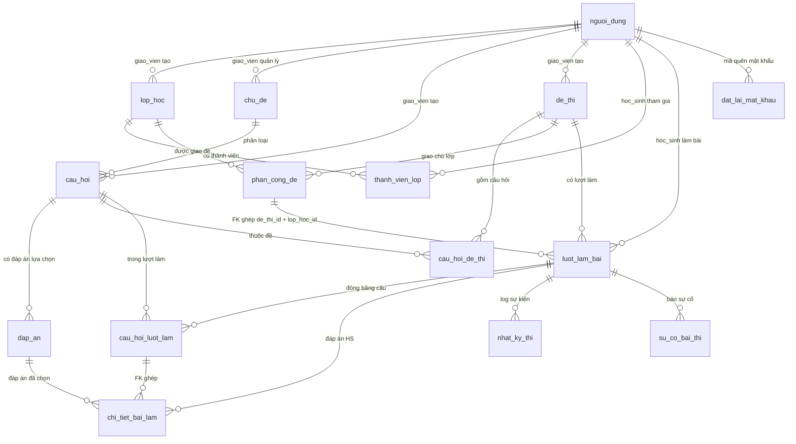
```mermaid
erDiagram
    nguoi_dung ||--o{ lop_hoc : "giao_vien tạo"
    nguoi_dung ||--o{ chu_de : "giao_vien quản lý"
    nguoi_dung ||--o{ cau_hoi : "giao_vien tạo"
    nguoi_dung ||--o{ de_thi : "giao_vien tạo"
    nguoi_dung ||--o{ thanh_vien_lop : "hoc_sinh tham gia"
    nguoi_dung ||--o{ luot_lam_bai : "hoc_sinh làm bài"
    nguoi_dung ||--o{ dat_lai_mat_khau : "mã quên mật khẩu"

    lop_hoc ||--o{ thanh_vien_lop : "có thành viên"
    lop_hoc ||--o{ phan_cong_de : "được giao đề"

    chu_de ||--o{ cau_hoi : "phân loại"

    cau_hoi ||--o{ dap_an : "có đáp án lựa chọn"
    cau_hoi ||--o{ cau_hoi_de_thi : "thuộc đề"
    cau_hoi ||--o{ cau_hoi_luot_lam : "trong lượt làm"

    de_thi ||--o{ cau_hoi_de_thi : "gồm câu hỏi"
    de_thi ||--o{ phan_cong_de : "giao cho lớp"
    de_thi ||--o{ luot_lam_bai : "có lượt làm"

    phan_cong_de ||--o{ luot_lam_bai : "FK ghép de_thi_id + lop_hoc_id"

    luot_lam_bai ||--o{ cau_hoi_luot_lam : "đóng băng câu"
    luot_lam_bai ||--o{ chi_tiet_bai_lam : "đáp án HS"
    luot_lam_bai ||--o{ nhat_ky_thi : "log sự kiện"
    luot_lam_bai ||--o{ su_co_bai_thi : "báo sự cố"

    cau_hoi_luot_lam ||--o{ chi_tiet_bai_lam : "FK ghép"
    dap_an ||--o{ chi_tiet_bai_lam : "đáp án đã chọn"
```

---

## Chi tiết từng bảng

### 1. nguoi_dung

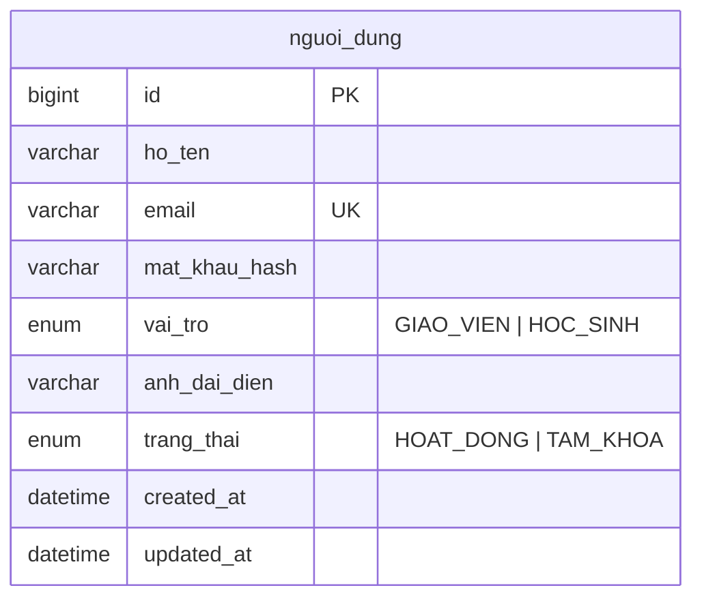
```mermaid
erDiagram
    nguoi_dung {
        bigint id PK
        varchar ho_ten
        varchar email UK
        varchar mat_khau_hash
        enum vai_tro "GIAO_VIEN | HOC_SINH"
        varchar anh_dai_dien
        enum trang_thai "HOAT_DONG | TAM_KHOA"
        datetime created_at
        datetime updated_at
    }
```

### 2. lop_hoc

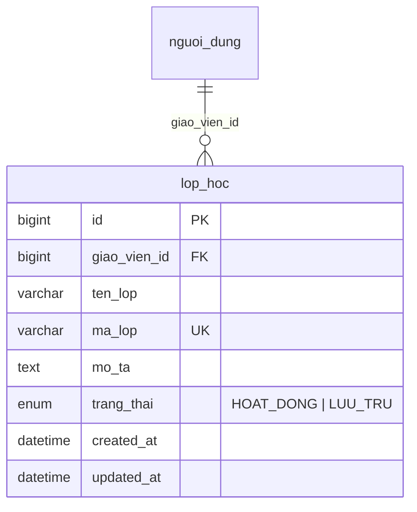
```mermaid
erDiagram
    nguoi_dung ||--o{ lop_hoc : giao_vien_id
    lop_hoc {
        bigint id PK
        bigint giao_vien_id FK
        varchar ten_lop
        varchar ma_lop UK
        text mo_ta
        enum trang_thai "HOAT_DONG | LUU_TRU"
        datetime created_at
        datetime updated_at
    }
```

### 3. thanh_vien_lop

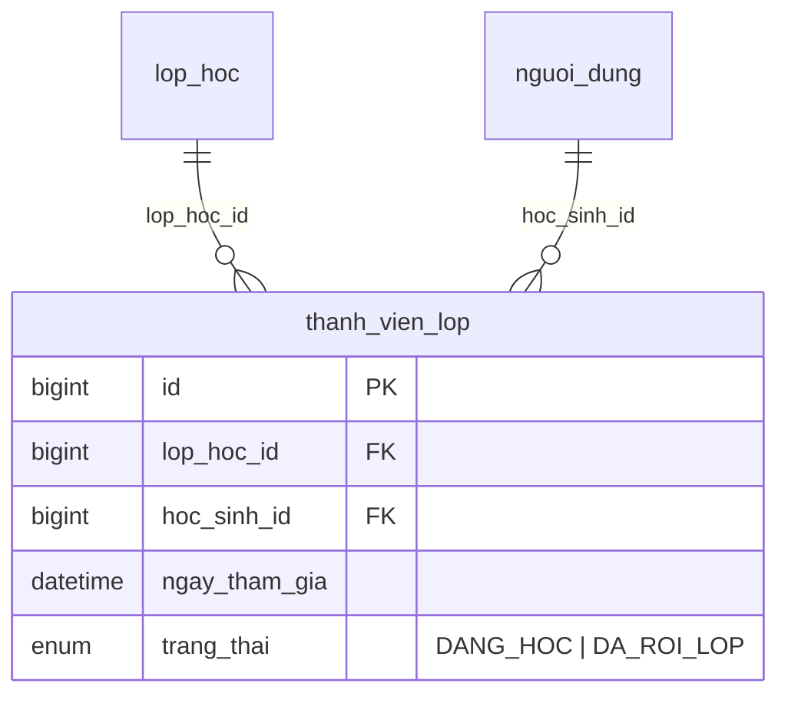
```mermaid
erDiagram
    lop_hoc ||--o{ thanh_vien_lop : lop_hoc_id
    nguoi_dung ||--o{ thanh_vien_lop : hoc_sinh_id
    thanh_vien_lop {
        bigint id PK
        bigint lop_hoc_id FK
        bigint hoc_sinh_id FK
        datetime ngay_tham_gia
        enum trang_thai "DANG_HOC | DA_ROI_LOP"
    }
```

### 4. chu_de

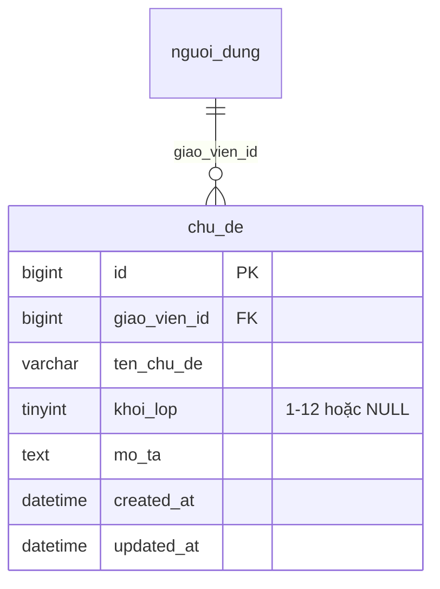
```mermaid
erDiagram
    nguoi_dung ||--o{ chu_de : giao_vien_id
    chu_de {
        bigint id PK
        bigint giao_vien_id FK
        varchar ten_chu_de
        tinyint khoi_lop "1-12 hoặc NULL"
        text mo_ta
        datetime created_at
        datetime updated_at
    }
```

### 5. cau_hoi

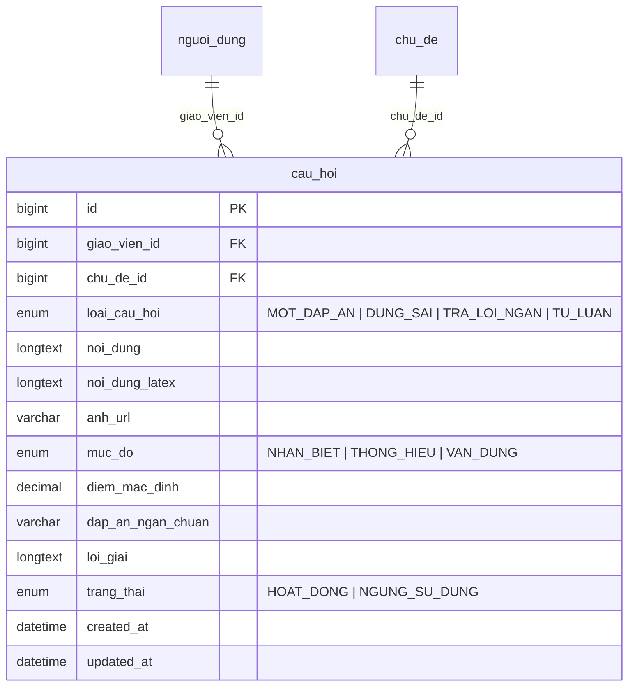
```mermaid
erDiagram
    nguoi_dung ||--o{ cau_hoi : giao_vien_id
    chu_de ||--o{ cau_hoi : chu_de_id
    cau_hoi {
        bigint id PK
        bigint giao_vien_id FK
        bigint chu_de_id FK
        enum loai_cau_hoi "MOT_DAP_AN | DUNG_SAI | TRA_LOI_NGAN | TU_LUAN"
        longtext noi_dung
        longtext noi_dung_latex
        varchar anh_url
        enum muc_do "NHAN_BIET | THONG_HIEU | VAN_DUNG"
        decimal diem_mac_dinh
        varchar dap_an_ngan_chuan
        longtext loi_giai
        enum trang_thai "HOAT_DONG | NGUNG_SU_DUNG"
        datetime created_at
        datetime updated_at
    }
```

### 6. dap_an

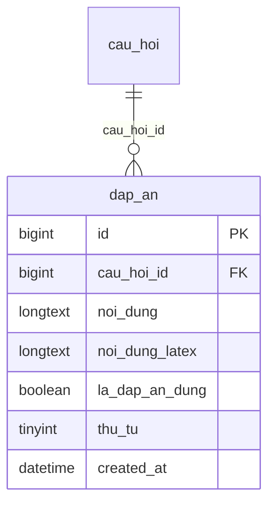
```mermaid
erDiagram
    cau_hoi ||--o{ dap_an : cau_hoi_id
    dap_an {
        bigint id PK
        bigint cau_hoi_id FK
        longtext noi_dung
        longtext noi_dung_latex
        boolean la_dap_an_dung
        tinyint thu_tu
        datetime created_at
    }
```

> Chỉ dùng cho `MOT_DAP_AN` và `DUNG_SAI`. `TRA_LOI_NGAN` / `TU_LUAN` không có dòng `dap_an`.

### 7. de_thi

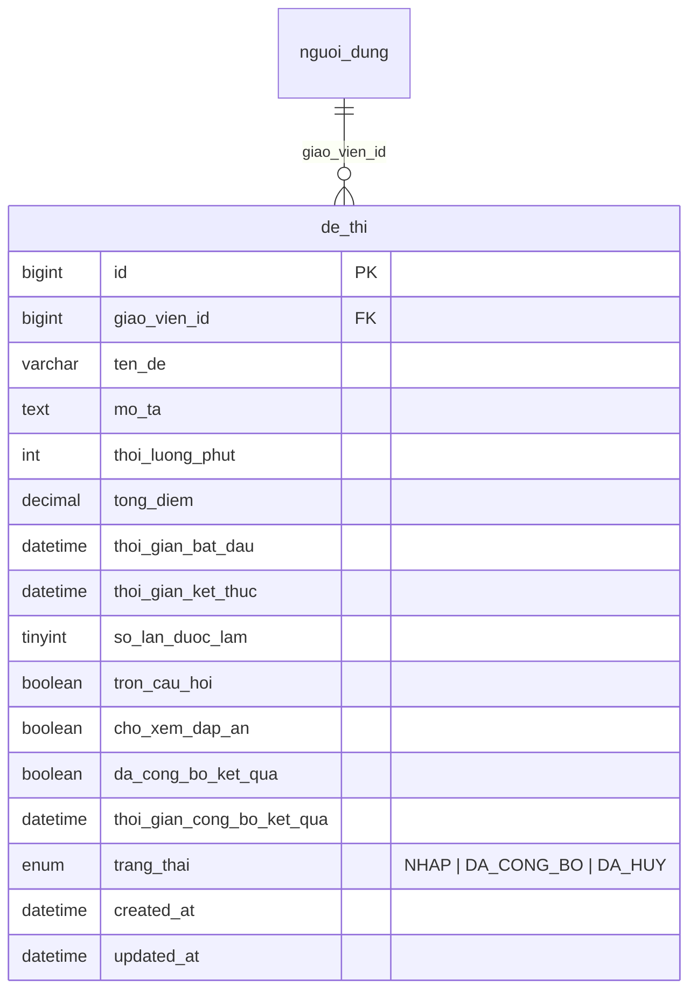
```mermaid
erDiagram
    nguoi_dung ||--o{ de_thi : giao_vien_id
    de_thi {
        bigint id PK
        bigint giao_vien_id FK
        varchar ten_de
        text mo_ta
        int thoi_luong_phut
        decimal tong_diem
        datetime thoi_gian_bat_dau
        datetime thoi_gian_ket_thuc
        tinyint so_lan_duoc_lam
        boolean tron_cau_hoi
        boolean cho_xem_dap_an
        boolean da_cong_bo_ket_qua
        datetime thoi_gian_cong_bo_ket_qua
        enum trang_thai "NHAP | DA_CONG_BO | DA_HUY"
        datetime created_at
        datetime updated_at
    }
```

### 8. cau_hoi_de_thi

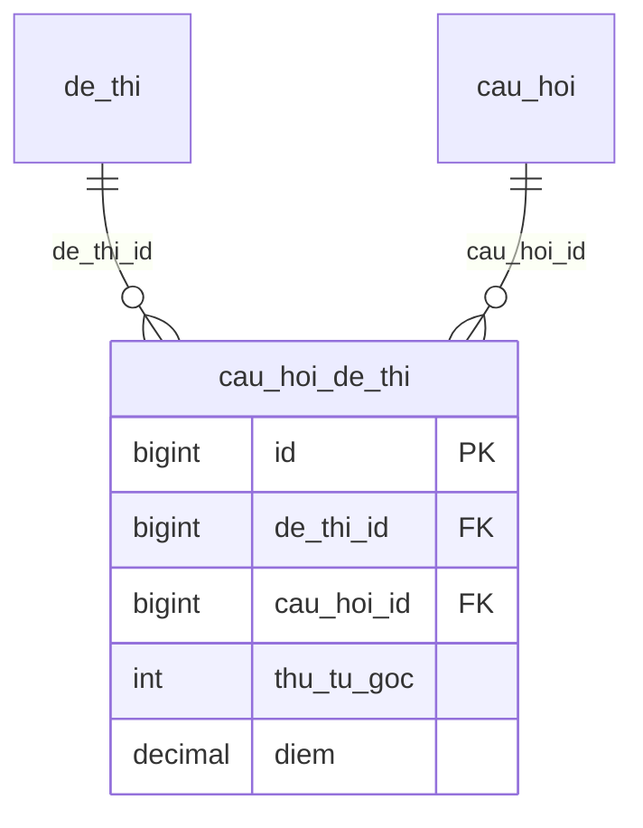
```mermaid
erDiagram
    de_thi ||--o{ cau_hoi_de_thi : de_thi_id
    cau_hoi ||--o{ cau_hoi_de_thi : cau_hoi_id
    cau_hoi_de_thi {
        bigint id PK
        bigint de_thi_id FK
        bigint cau_hoi_id FK
        int thu_tu_goc
        decimal diem
    }
```

### 9. phan_cong_de

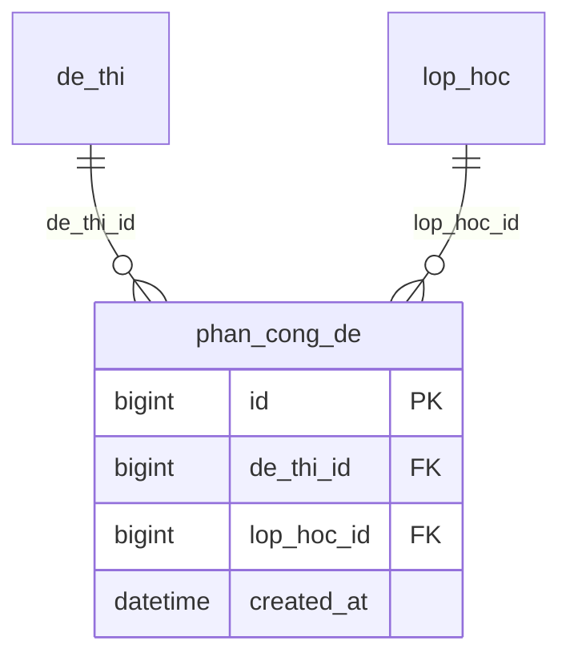
```mermaid
erDiagram
    de_thi ||--o{ phan_cong_de : de_thi_id
    lop_hoc ||--o{ phan_cong_de : lop_hoc_id
    phan_cong_de {
        bigint id PK
        bigint de_thi_id FK
        bigint lop_hoc_id FK
        datetime created_at
    }
```

> UK `(de_thi_id, lop_hoc_id)` — được tham chiếu bởi FK ghép của `luot_lam_bai`.

### 10. luot_lam_bai

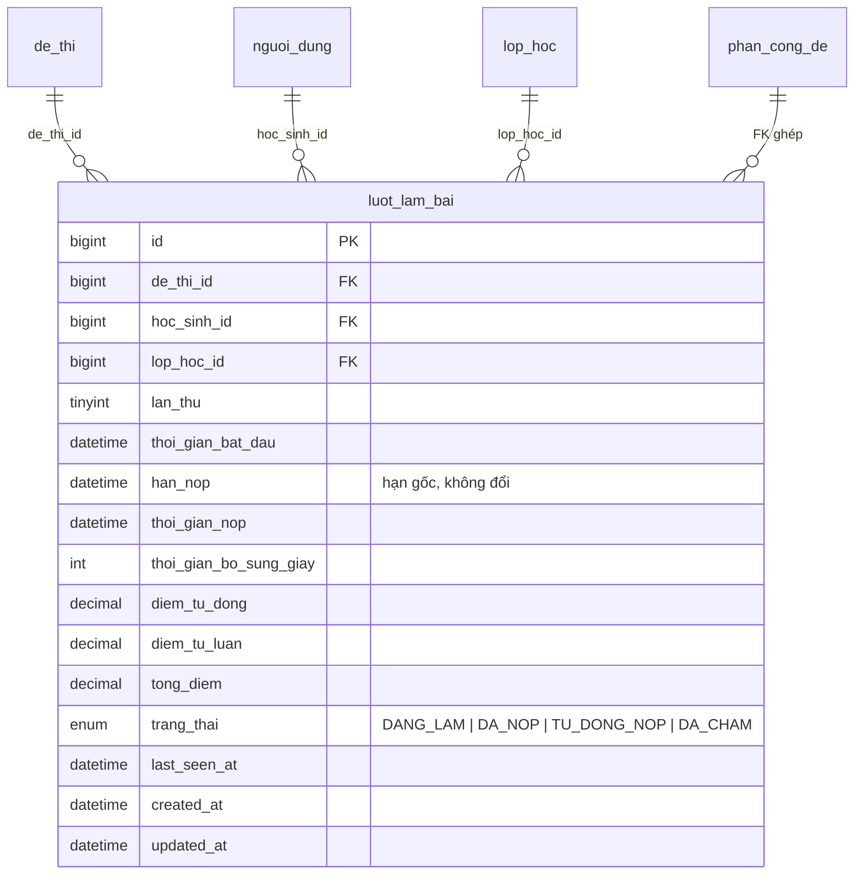
```mermaid
erDiagram
    de_thi ||--o{ luot_lam_bai : de_thi_id
    nguoi_dung ||--o{ luot_lam_bai : hoc_sinh_id
    lop_hoc ||--o{ luot_lam_bai : lop_hoc_id
    phan_cong_de ||--o{ luot_lam_bai : "FK ghép"
    luot_lam_bai {
        bigint id PK
        bigint de_thi_id FK
        bigint hoc_sinh_id FK
        bigint lop_hoc_id FK
        tinyint lan_thu
        datetime thoi_gian_bat_dau
        datetime han_nop "hạn gốc, không đổi"
        datetime thoi_gian_nop
        int thoi_gian_bo_sung_giay
        decimal diem_tu_dong
        decimal diem_tu_luan
        decimal tong_diem
        enum trang_thai "DANG_LAM | DA_NOP | TU_DONG_NOP | DA_CHAM"
        datetime last_seen_at
        datetime created_at
        datetime updated_at
    }
```

### 11. cau_hoi_luot_lam

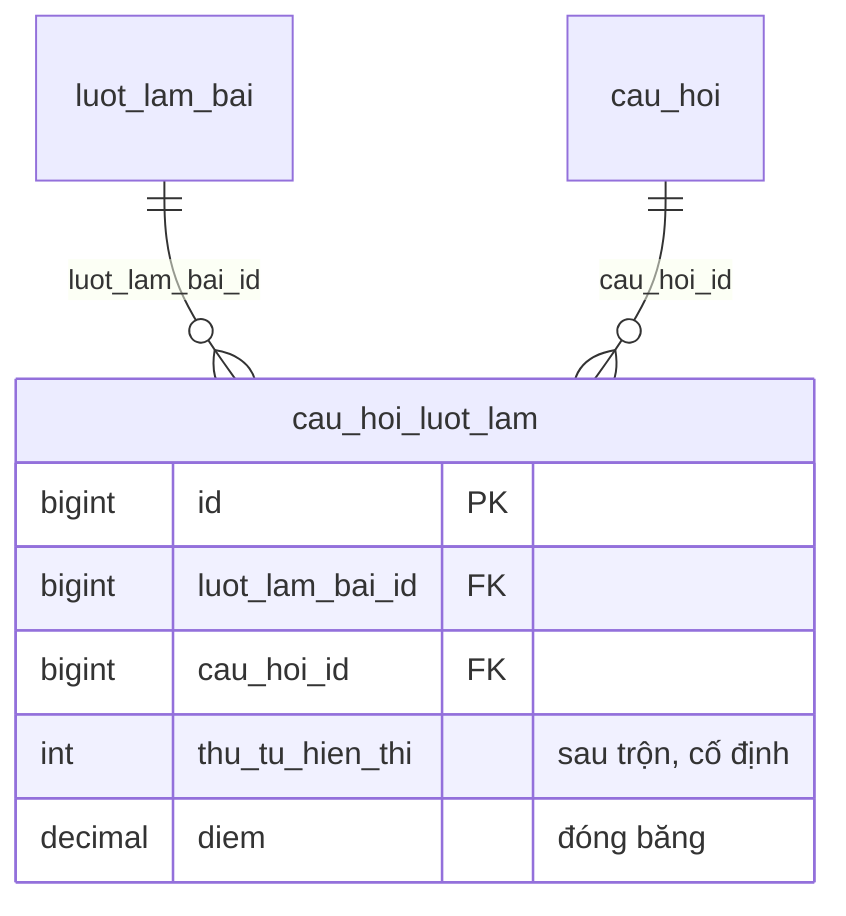
```mermaid
erDiagram
    luot_lam_bai ||--o{ cau_hoi_luot_lam : luot_lam_bai_id
    cau_hoi ||--o{ cau_hoi_luot_lam : cau_hoi_id
    cau_hoi_luot_lam {
        bigint id PK
        bigint luot_lam_bai_id FK
        bigint cau_hoi_id FK
        int thu_tu_hien_thi "sau trộn, cố định"
        decimal diem "đóng băng"
    }
```

### 12. chi_tiet_bai_lam

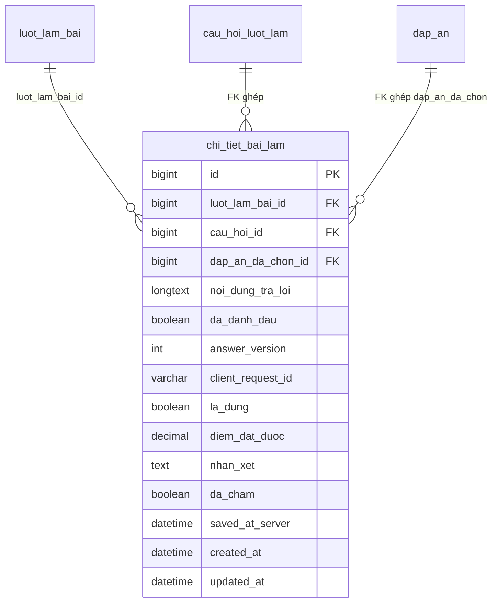
```mermaid
erDiagram
    luot_lam_bai ||--o{ chi_tiet_bai_lam : luot_lam_bai_id
    cau_hoi_luot_lam ||--o{ chi_tiet_bai_lam : "FK ghép"
    dap_an ||--o{ chi_tiet_bai_lam : "FK ghép dap_an_da_chon"
    chi_tiet_bai_lam {
        bigint id PK
        bigint luot_lam_bai_id FK
        bigint cau_hoi_id FK
        bigint dap_an_da_chon_id FK
        longtext noi_dung_tra_loi
        boolean da_danh_dau
        int answer_version
        varchar client_request_id
        boolean la_dung
        decimal diem_dat_duoc
        text nhan_xet
        boolean da_cham
        datetime saved_at_server
        datetime created_at
        datetime updated_at
    }
```

### 13. nhat_ky_thi

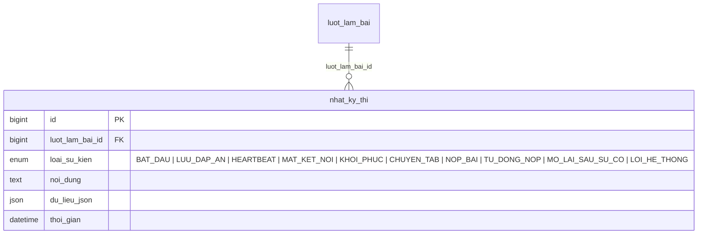
```mermaid
erDiagram
    luot_lam_bai ||--o{ nhat_ky_thi : luot_lam_bai_id
    nhat_ky_thi {
        bigint id PK
        bigint luot_lam_bai_id FK
        enum loai_su_kien "BAT_DAU | LUU_DAP_AN | HEARTBEAT | MAT_KET_NOI | KHOI_PHUC | CHUYEN_TAB | NOP_BAI | TU_DONG_NOP | MO_LAI_SAU_SU_CO | LOI_HE_THONG"
        text noi_dung
        json du_lieu_json
        datetime thoi_gian
    }
```

### 14. su_co_bai_thi

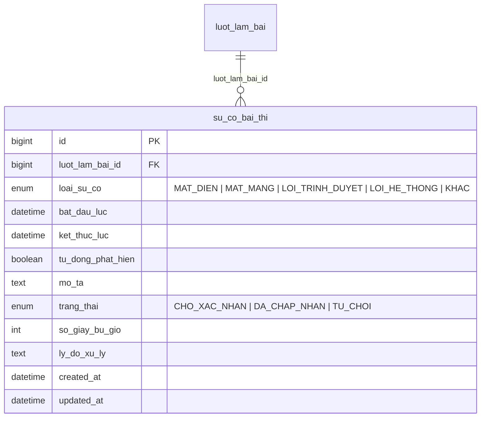
```mermaid
erDiagram
    luot_lam_bai ||--o{ su_co_bai_thi : luot_lam_bai_id
    su_co_bai_thi {
        bigint id PK
        bigint luot_lam_bai_id FK
        enum loai_su_co "MAT_DIEN | MAT_MANG | LOI_TRINH_DUYET | LOI_HE_THONG | KHAC"
        datetime bat_dau_luc
        datetime ket_thuc_luc
        boolean tu_dong_phat_hien
        text mo_ta
        enum trang_thai "CHO_XAC_NHAN | DA_CHAP_NHAN | TU_CHOI"
        int so_giay_bu_gio
        text ly_do_xu_ly
        datetime created_at
        datetime updated_at
    }
```

---

### 15. dat_lai_mat_khau

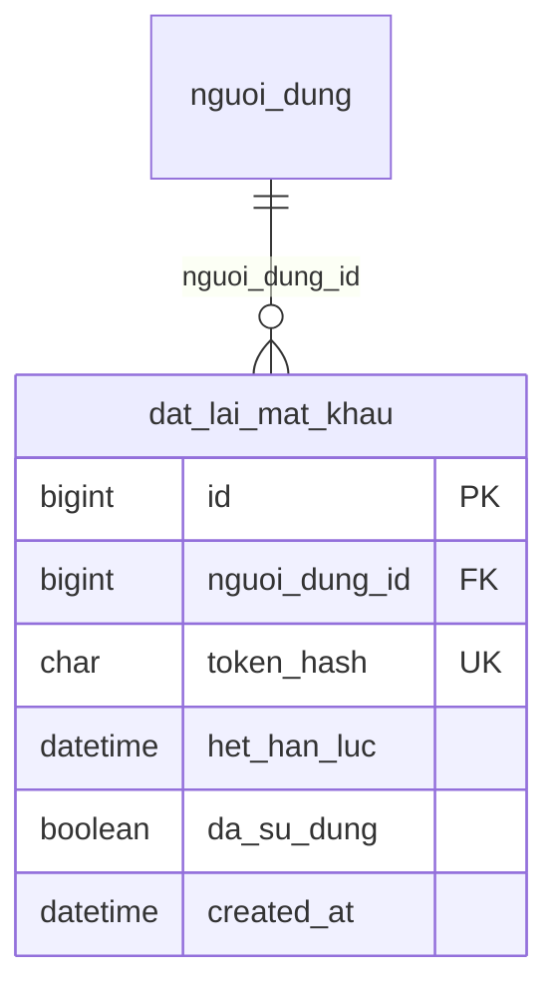
```mermaid
erDiagram
    nguoi_dung ||--o{ dat_lai_mat_khau : nguoi_dung_id
    dat_lai_mat_khau {
        bigint id PK
        bigint nguoi_dung_id FK
        char token_hash UK
        datetime het_han_luc
        boolean da_su_dung
        datetime created_at
    }
```

---

## FK ghép quan trọng

| Bảng con | Cột | Tham chiếu | Mục đích |
|----------|-----|------------|----------|
| `luot_lam_bai` | `(de_thi_id, lop_hoc_id)` | `phan_cong_de` | HS chỉ làm đề qua lớp đã được giao |
| `chi_tiet_bai_lam` | `(luot_lam_bai_id, cau_hoi_id)` | `cau_hoi_luot_lam` | Đáp án chỉ thuộc câu trong lượt |
| `chi_tiet_bai_lam` | `(cau_hoi_id, dap_an_da_chon_id)` | `dap_an` | Đáp án chọn phải thuộc đúng câu |

---

## Ghi chú thiết kế

- **CHECK constraint** (điểm > 0, thời gian hợp lệ, khối lớp 1–12…) yêu cầu MySQL >= 8.0.16.
- Trạng thái "đề đang mở/đã đóng" **suy ra** từ `thoi_gian_bat_dau` / `thoi_gian_ket_thuc`, không lưu cứng.
- `han_nop` gốc không đổi; bù giờ cộng vào `thoi_gian_bo_sung_giay`.
- Múi giờ: `+07:00` (Asia/Ho_Chi_Minh) thống nhất giữa Node.js và MySQL.
