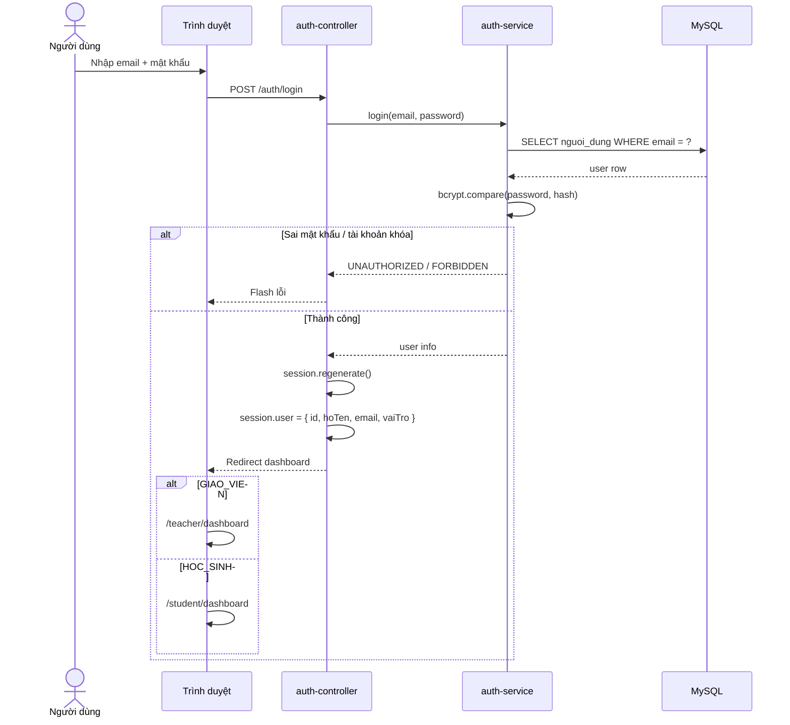
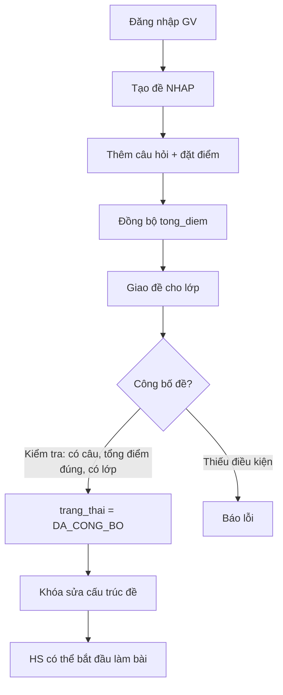
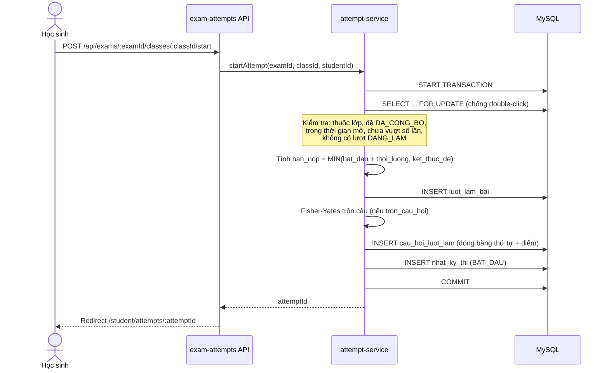
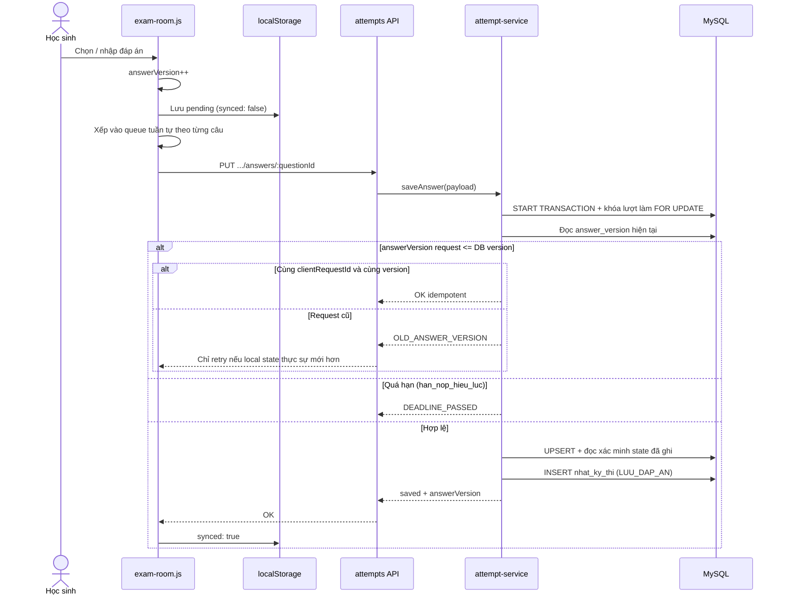
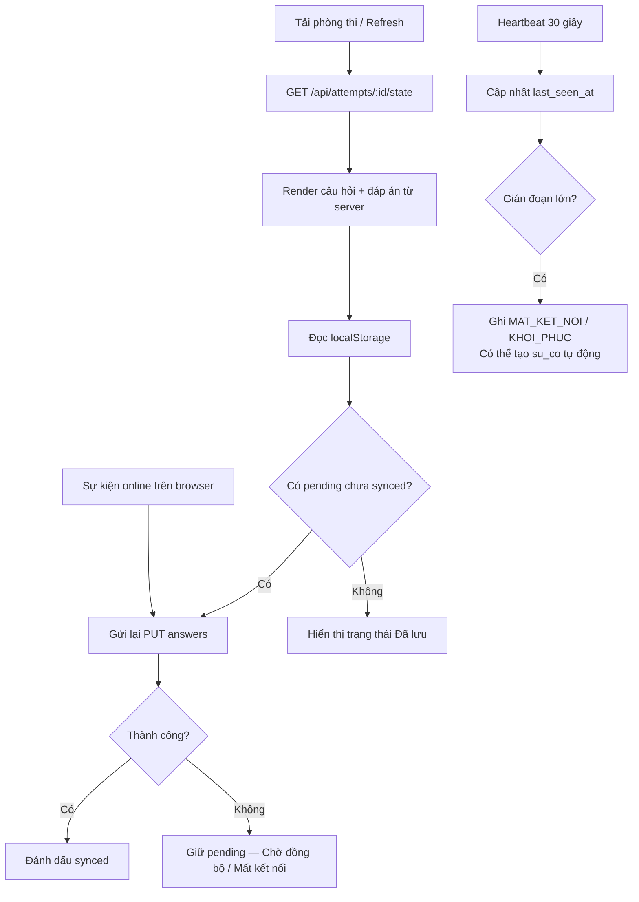
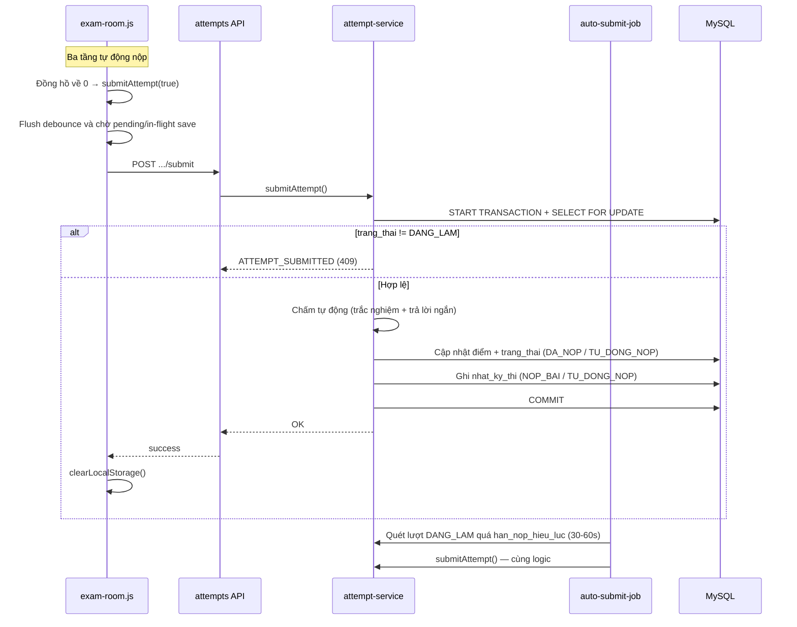
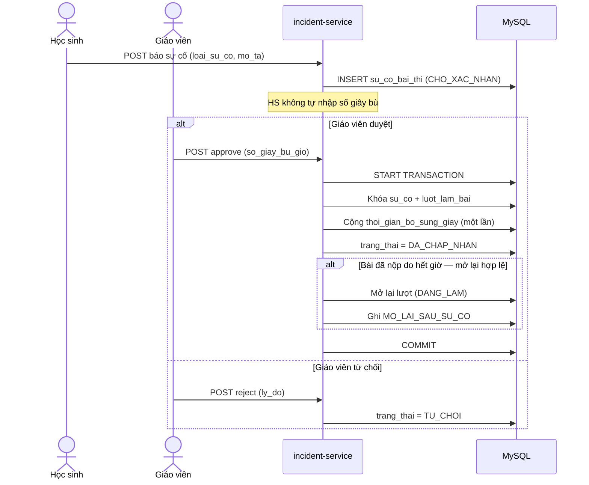
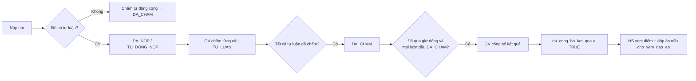

# Kiến trúc hệ thống

> Website kiểm tra Toán trực tuyến — hỗ trợ tự động lưu và khôi phục bài làm

## 1. Tổng quan kiến trúc

Hệ thống theo mô hình **3 tầng** (Three-tier): trình duyệt ↔ server Node.js/Express ↔ MySQL.

```
┌─────────────────────────────────────────────────────────────┐
│                     TRÌNH DUYỆT (Client)                     │
│  EJS views │ exam-room.js │ localStorage │ Fetch API │ KaTeX │
└────────────────────────────┬────────────────────────────────┘
                             │ HTTP (session cookie + CSRF)
                             ▼
┌─────────────────────────────────────────────────────────────┐
│                   EXPRESS SERVER (Node.js)                   │
│                                                              │
│  ┌─────────┐   ┌─────────────┐   ┌──────────┐   ┌────────┐ │
│  │ Routes  │ → │ Controllers │ → │ Services │ → │ Repos  │ │
│  └─────────┘   └─────────────┘   └──────────┘   └───┬────┘ │
│         ▲                                            │       │
│  ┌──────┴──────┐  ┌────────────┐  ┌──────────────┐  │       │
│  │ Middleware  │  │ Validators │  │ Jobs         │  │       │
│  │ auth, csrf  │  │            │  │ auto-submit  │  │       │
│  │ rate-limit  │  │            │  │              │  │       │
│  └─────────────┘  └────────────┘  └──────────────┘  │       │
└──────────────────────────────────────────────────────┼───────┘
                                                       │ mysql2 pool
                                                       ▼
┌─────────────────────────────────────────────────────────────┐
│                    MySQL (web_kiem_tra_toan)                 │
│  15 bảng nghiệp vụ + bảng sessions (express-mysql-session)  │
└─────────────────────────────────────────────────────────────┘
```

### Phân tầng chi tiết

| Tầng | Thư mục | Trách nhiệm |
|------|---------|-------------|
| Route | `src/routes/` | Ánh xạ URL → controller; phân nhóm teacher / student / api |
| Controller | `src/controllers/` | Nhận request, gọi service, trả view hoặc JSON |
| Service | `src/services/` | Nghiệp vụ: kiểm tra quyền, transaction, quy tắc thời gian |
| Repository | `src/repositories/` | SQL với placeholder, không chứa logic nghiệp vụ |
| Middleware | `src/middleware/` | Auth, CSRF, rate limit, upload, flash, error handler |
| Job | `src/jobs/` | Quét lượt quá hạn và tự động nộp bài |

### Hai kênh giao tiếp

1. **Server-rendered (EJS):** form đăng nhập, quản lý lớp/câu hỏi/đề, chấm bài, thống kê.
2. **REST API (JSON):** phòng thi — bắt đầu lượt, lấy state, lưu đáp án, heartbeat, nộp bài.

---

## 2. Luồng đăng nhập



**Điểm quan trọng:**
- Email được chuẩn hóa `trim().toLowerCase()` trước khi tra cứu.
- Session lưu trong MySQL qua `express-mysql-session`.
- Cookie: `httpOnly`, `sameSite: lax`, `secure` khi production.

---

## 3. Luồng giáo viên tạo và công bố đề



**Quy tắc:**
- Chỉ sửa cấu trúc đề khi `trang_thai = NHAP`.
- Sau `DA_CONG_BO`: không thêm/xóa/đổi câu, điểm, thời lượng.
- Công bố đề ≠ công bố kết quả (hai bước độc lập).

---

## 4. Luồng học sinh bắt đầu bài



**Điểm quan trọng:**
- Thứ tự câu và điểm được **đóng băng** tại `cau_hoi_luot_lam`.
- Hai request đồng thời: một thành công, request còn lại trả về lượt vừa tạo.

---

## 5. Luồng autosave (lưu đáp án online)



**Tần suất debounce:** trắc nghiệm gửi ngay; trả lời ngắn ~600 ms; tự luận ~1500 ms.

Backend không dựa vào `affectedRows` để nhận biết request cũ, vì MySQL có thể bật `CLIENT_FOUND_ROWS` và trả số dòng khớp ngay cả khi UPDATE không đổi dữ liệu.

---

## 6. Luồng khôi phục (refresh / mất mạng)



**Nguyên tắc:**
- Thứ tự câu **không đổi** sau refresh (đọc từ `cau_hoi_luot_lam`).
- localStorage key: `math_exam_user_<userId>_attempt_<attemptId>`.
- Chỉ xóa localStorage sau nộp bài thành công.

---

## 7. Luồng nộp bài



**Chống nộp hai lần:** chỉ cập nhật khi `trang_thai = DANG_LAM`, kiểm tra `affectedRows`.

Nộp thủ công bị chặn nếu còn đáp án chưa lưu; auto-submit vẫn gửi lệnh nộp khi hết giờ. Save và submit cùng khóa dòng lượt làm trước nên server không chấm một snapshot nằm giữa lần lưu.

---

## 8. Luồng xử lý sự cố và bù giờ



**Công thức hạn sau bù giờ:**

```
han_nop_hieu_luc = han_nop + thoi_gian_bo_sung_giay
```

`han_nop` gốc **không đổi**; giây bù cộng vào cột riêng.

---

## 9. Luồng chấm điểm và công bố kết quả



---

## 10. Bảo mật trong kiến trúc

| Cơ chế | Vị trí |
|--------|--------|
| bcrypt hash mật khẩu | `auth-service` |
| Session MySQL store | `app.js` + `express-mysql-session` |
| CSRF token | `middleware/csrf.js` — form EJS + header Fetch |
| Rate limit | `middleware/rate-limits.js` — login, register, start, submit, incident |
| SQL placeholder | Tất cả repository dùng `pool.execute(?, [...])` |
| Helmet + CSP | `app.js` — KaTeX/Chart.js serve cục bộ |
| Kiểm tra sở hữu | Service layer — GV chỉ thao tác dữ liệu của mình |
| Không lộ đáp án đúng | API state phòng thi không trả `la_dap_an_dung` |

---

## 11. Tài liệu tham chiếu

- Quy tắc nghiệp vụ chi tiết: `docs/service-rules.md`
- Mô tả 15 bảng: `docs/database-description.md`
- ERD: `diagrams/erd.md`
- API: `docs/api.md`
