# Sơ đồ phân rã chức năng — JinMath

Sơ đồ phân rã từ mức 0 đến mức 2, bám theo phạm vi V1 và mã nguồn trong `src/`.
Đây là **một sơ đồ phân rã chức năng**, không phải DFD: các nhánh thể hiện hệ thống làm gì,
không mô tả hướng truyền dữ liệu.

```mermaid
flowchart LR
    SYS["0. HỆ THỐNG KIỂM TRA TOÁN TRỰC TUYẾN<br/>JinMath"]

    SYS --> A["1. Quản lý tài khoản<br/>và xác thực"]
    SYS --> B["2. Quản lý lớp học"]
    SYS --> C["3. Quản lý ngân hàng<br/>câu hỏi"]
    SYS --> D["4. Quản lý đề thi"]
    SYS --> E["5. Tổ chức làm bài<br/>trực tuyến"]
    SYS --> F["6. Chấm điểm và<br/>công bố kết quả"]
    SYS --> G["7. Quản lý sự cố<br/>và bù giờ"]
    SYS --> H["8. Thống kê, nhật ký<br/>và an toàn hệ thống"]

    A --> A1["1.1 Đăng ký học sinh"]
    A --> A2["1.2 Đăng nhập / đăng xuất"]
    A --> A3["1.3 Quên và đặt lại mật khẩu"]
    A --> A4["1.4 Quản lý session và phân quyền<br/>Giáo viên / Học sinh"]

    B --> B1["2.1 Tạo, sửa lớp"]
    B --> B2["2.2 Lưu trữ / xóa lớp"]
    B --> B3["2.3 Quản lý thành viên"]
    B --> B4["2.4 Tham gia lớp bằng mã"]
    B --> B5["2.5 Rời lớp có kiểm tra<br/>bài đang làm"]

    C --> C1["3.1 Quản lý chủ đề"]
    C --> C2["3.2 Tạo / sửa / sao chép câu hỏi<br/>Một đáp án · Đúng/Sai 4 mệnh đề<br/>Trả lời ngắn · Tự luận"]
    C --> C3["3.3 Phân loại khối lớp,<br/>mức độ, chủ đề"]
    C --> C4["3.4 Nội dung LaTeX<br/>và hình ảnh"]
    C --> C5["3.5 Bảo toàn câu hỏi<br/>đã có lịch sử thi"]
    D --> D1["4.1 Tạo / sửa đề nháp"]
    D --> D2["4.2 Chọn câu và<br/>thiết lập điểm"]
    D --> D3["4.3 Tính tổng điểm"]
    D --> D4["4.4 Giao / hủy giao<br/>đề cho lớp"]
    D --> D5["4.5 Công bố đề<br/>Kiểm tra câu hỏi, lớp được giao,<br/>thời gian và tổng điểm"]
    D --> D6["4.6 Hủy / xóa đề<br/>theo chính sách"]
    E --> E1["5.1 Kiểm tra quyền,<br/>thời gian, số lần làm"]
    E --> E2["5.2 Tạo / tiếp tục<br/>lượt làm"]
    E --> E3["5.3 Đóng băng và<br/>trộn thứ tự câu"]
    E --> E4["5.4 Làm bài / đánh dấu câu"]
    E --> E5["5.5 Autosave lên server<br/>answerVersion chống request cũ<br/>clientRequestId đảm bảo idempotent"]
    E --> E6["5.6 Lưu tạm localStorage"]
    E --> E7["5.7 Khôi phục và<br/>đồng bộ khi có mạng"]
    E --> E8["5.8 Heartbeat / đồng hồ<br/>theo thời gian server"]
    E --> E9["5.9 Nộp thủ công /<br/>tự nộp khi hết giờ"]
    F --> F1["6.1 Chấm tự động<br/>Một đáp án · Đúng/Sai theo mệnh đề<br/>Trả lời ngắn đã chuẩn hóa"]
    F --> F2["6.2 Giáo viên chấm tự luận"]
    F --> F3["6.3 Tính lại tổng điểm"]
    F --> F4["6.4 Kiểm tra điều kiện<br/>công bố kết quả"]
    F --> F5["6.5 Công bố kết quả"]
    F --> F6["6.6 Học sinh xem điểm<br/>và đáp án được phép"]
    G --> G1["7.1 Học sinh báo sự cố"]
    G --> G2["7.2 Phát hiện gián đoạn<br/>qua heartbeat"]
    G --> G3["7.3 Giáo viên duyệt / từ chối"]
    G --> G4["7.4 Cộng thời gian bù"]
    G --> G5["7.5 Mở lại bài đã nộp<br/>và đặt lại điểm cần thiết"]

    H --> H1["8.1 Dashboard giáo viên / học sinh"]
    H --> H2["8.2 Thống kê theo đề"]
    H --> H3["8.3 Nhật ký sự kiện thi"]
    H --> H4["8.4 CSRF và rate limit"]
    H --> H5["8.5 Kiểm tra quyền sở hữu"]
    H --> H6["8.6 Upload an toàn và<br/>xử lý lỗi"]

    classDef root fill:#173b6c,color:#fff,stroke:#0e2748,stroke-width:2px;
    classDef module fill:#dbeafe,color:#102a43,stroke:#2563eb,stroke-width:1.5px;
    classDef function fill:#fff,color:#1f2937,stroke:#94a3b8;
    class SYS root;
    class A,B,C,D,E,F,G,H module;
    class A1,A2,A3,A4,B1,B2,B3,B4,B5,C1,C2,C3,C4,C5,D1,D2,D3,D4,D5,D6,E1,E2,E3,E4,E5,E6,E7,E8,E9,F1,F2,F3,F4,F5,F6,G1,G2,G3,G4,G5,H1,H2,H3,H4,H5,H6 function;
```

## Quy ước mức phân rã

- **Mức 0:** toàn bộ hệ thống JinMath.
- **Mức 1:** tám phân hệ nghiệp vụ chính.
- **Mức 2:** chức năng cụ thể người dùng hoặc hệ thống thực hiện.
- Các chi tiết quan trọng về bốn loại câu hỏi, điều kiện công bố đề, autosave và
  chấm tự động được ghi ngay trong nút chức năng tương ứng để sơ đồ dễ đọc.

## Đối chiếu mã nguồn

| Phân hệ | Thành phần chính |
|---|---|
| Tài khoản | `auth-controller`, `auth-service`, `session-auth`, `password-reset-repository` |
| Lớp học | `teacher/student-class-controller`, `class-service`, `class-repository` |
| Câu hỏi | `teacher-question-controller`, `question-service`, `question/answer-repository` |
| Đề thi | `teacher-exam-controller`, `exam-service`, `exam/exam-question-repository` |
| Làm bài | `attempt-controller`, `attempt-service`, `exam-room.js`, `auto-submit-job` |
| Chấm và kết quả | `grading-service`, `result-service`, `attempt/exam-repository` |
| Sự cố | `student/teacher-incident-controller`, `incident-service`, `incident-repository` |
| Thống kê và an toàn | `statistics-service`, middleware xác thực, CSRF, rate limit, upload |
