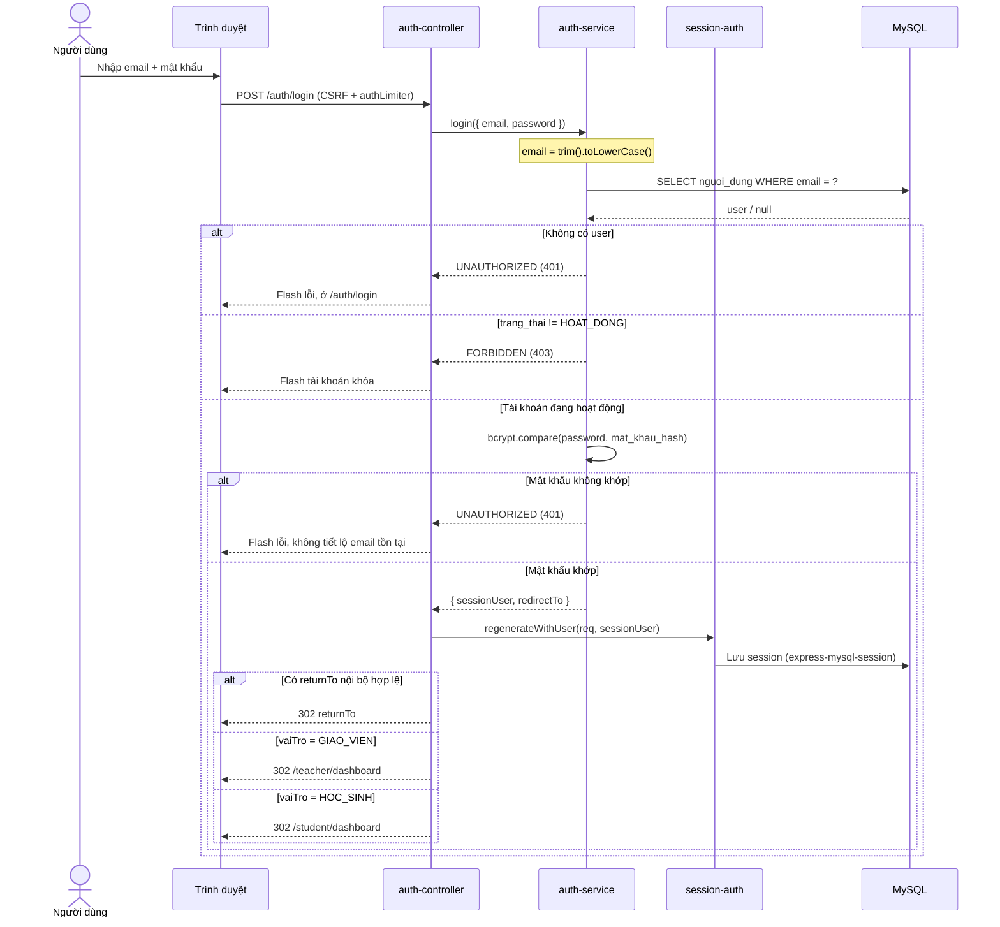
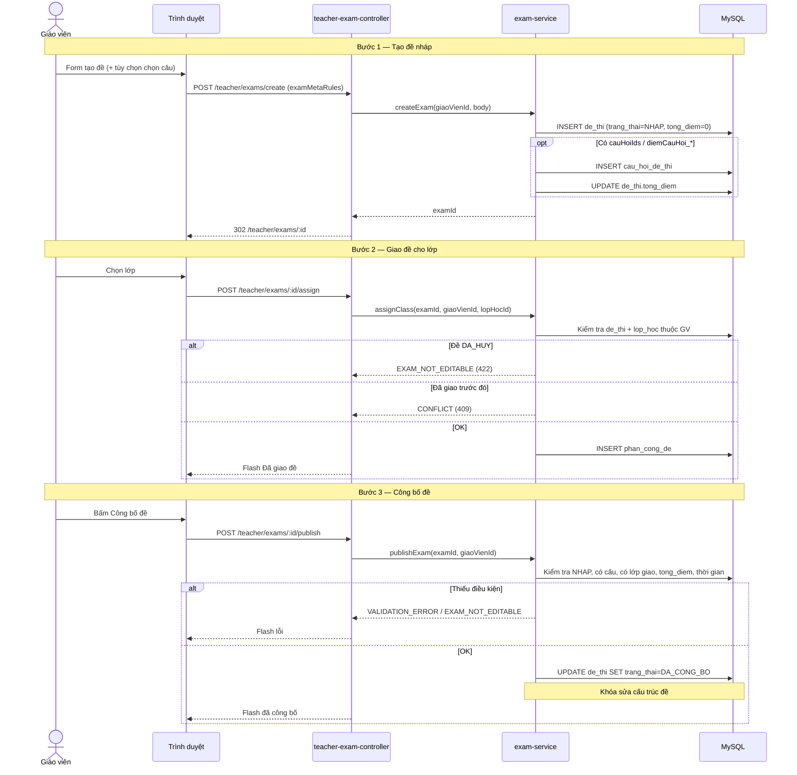
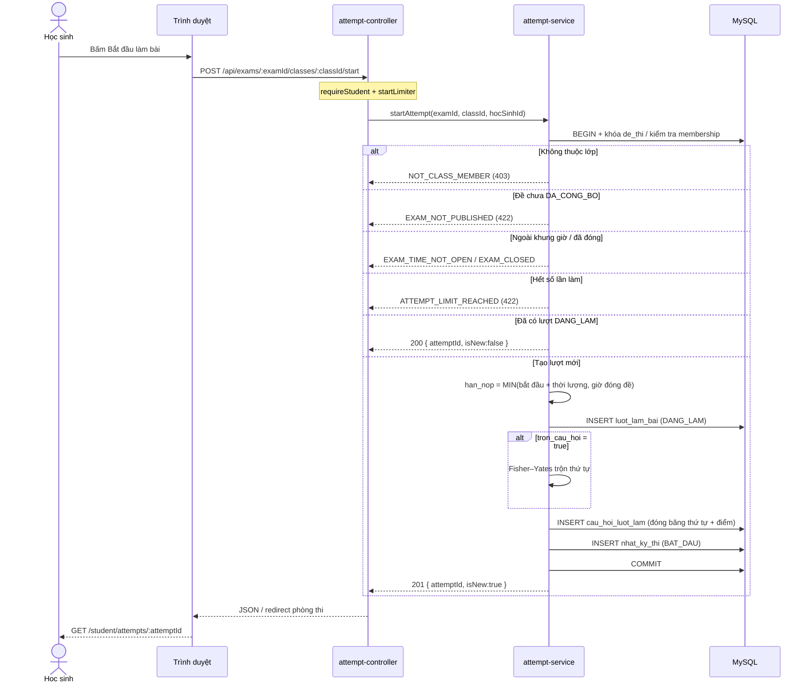
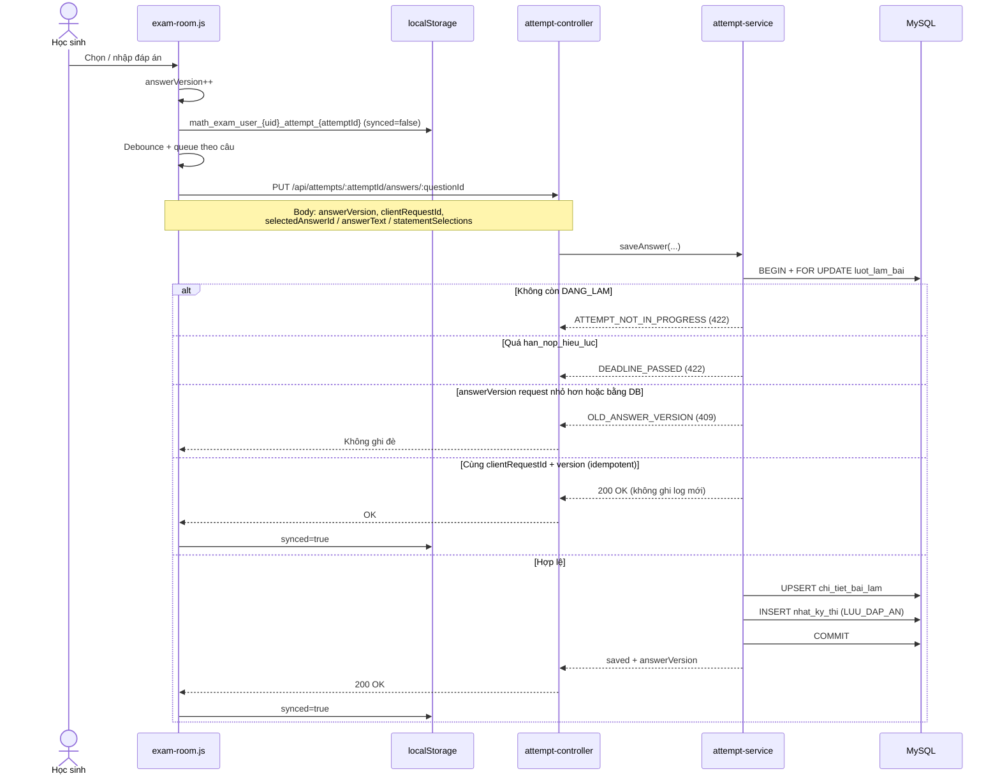
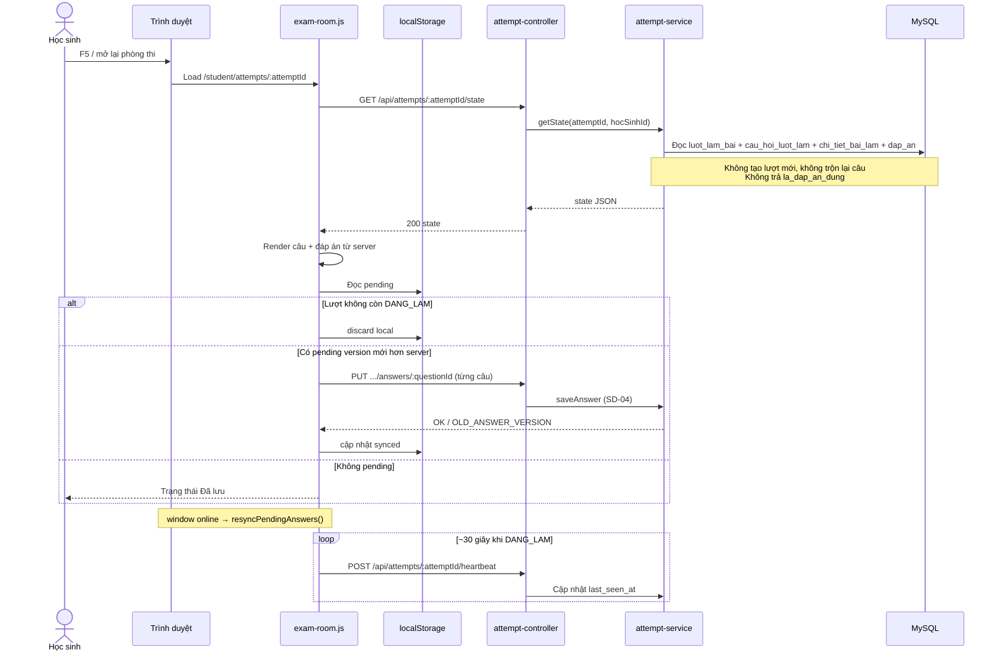
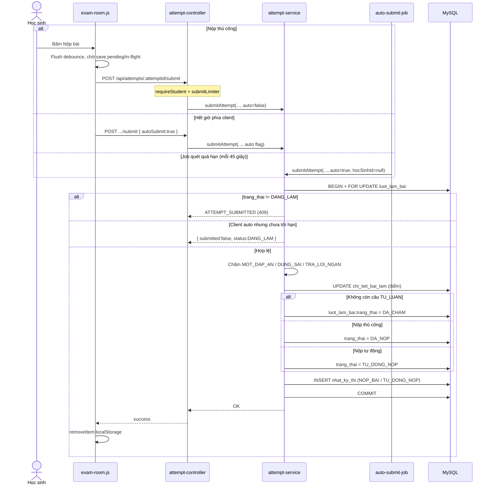
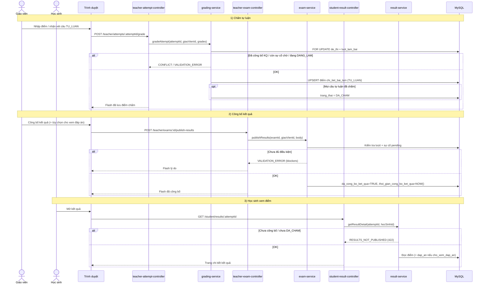
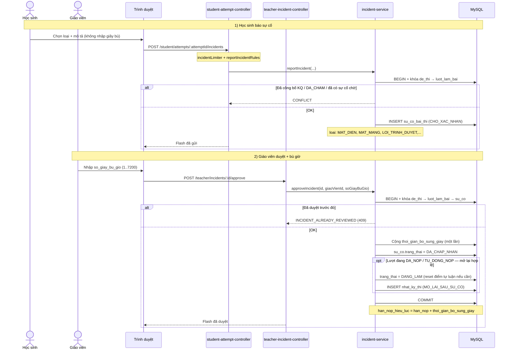
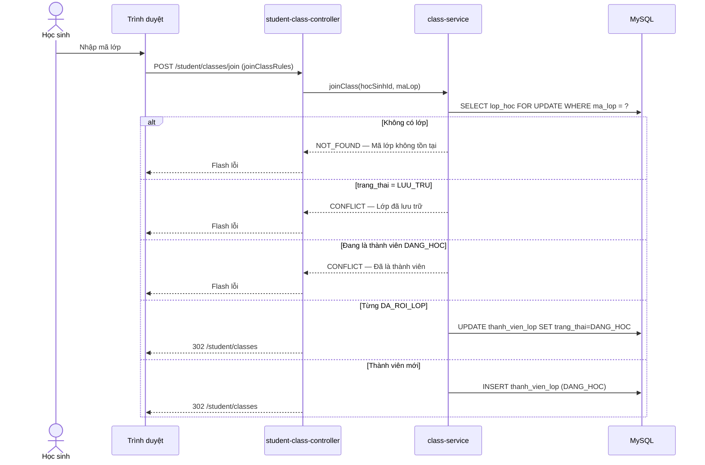
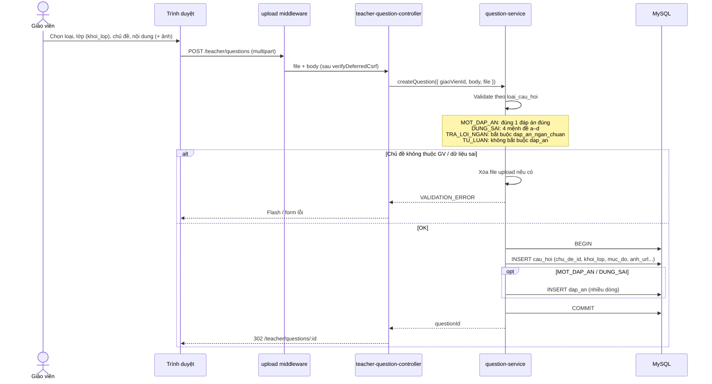

# 10 sơ đồ tuần tự — khớp `src` hiện tại

> Nguồn: route / controller / service thật trong `math-exam-system/src`.  
> Xem trước: mở `docs/sequence-diagrams-preview.html`.  
> Ảnh SVG/PNG để chèn báo cáo: `docs/diagrams/sequence/`.

| Mã | Luồng | Endpoint chính |
|----|--------|----------------|
| SD-01 | Đăng nhập | `POST /auth/login` |
| SD-02 | Tạo đề → giao lớp → công bố | `POST /teacher/exams/create` → `.../assign` → `.../publish` |
| SD-03 | Bắt đầu bài + đóng băng câu | `POST /api/exams/:examId/classes/:classId/start` |
| SD-04 | Autosave đáp án | `PUT /api/attempts/:attemptId/answers/:questionId` |
| SD-05 | Khôi phục phiên | `GET /api/attempts/:attemptId/state` + sync local |
| SD-06 | Nộp bài + chấm tự động | `POST /api/attempts/:attemptId/submit` |
| SD-07 | Chấm TL → công bố KQ → HS xem | grade → publish-results → results |
| SD-08 | Báo sự cố → duyệt bù giờ | report → approve |
| SD-09 | Tham gia lớp bằng mã | `POST /student/classes/join` |
| SD-10 | Tạo câu hỏi | `POST /teacher/questions` |

---

## SD-01 — Đăng nhập (session)

**File:** `routes/auth.js` → `auth-controller.login` → `auth-service.login` → `session-auth.regenerateWithUser`

---

## SD-02 — Tạo đề → giao lớp → công bố đề

**File:** `routes/teacher/exams.js` → `teacher-exam-controller` → `exam-service`  
(`createExam` / `assignClass` / `publishExam`)

---

## SD-03 — Bắt đầu bài + đóng băng câu

**File:** `routes/api/exam-attempts.js` → `attempt-controller.start` → `attempt-service.startAttempt`

---

## SD-04 — Autosave đáp án (`answer_version`)

**File:** `routes/api/attempts.js` → `attempt-controller.saveAnswer` → `attempt-service.saveAnswer`  
**Client:** `public/js/exam-room.js`

---

## SD-05 — Khôi phục phiên (refresh / offline → online)

**Server:** `GET /api/attempts/:attemptId/state` → `attempt-service.getState`  
**Client:** `exam-room.js` (`mergeWithLocalPending` + `resyncPendingAnswers`)

---

## SD-06 — Nộp bài + chấm tự động

**File:** `POST /api/attempts/:attemptId/submit` → `attempt-service.submitAttempt`  
(Job server cũng gọi cùng `submitAttempt` khi quá `han_nop_hieu_luc`)

---

## SD-07 — Chấm tự luận → công bố kết quả → HS xem điểm

**Grade:** `POST /teacher/attempts/:attemptId/grade` → `grading-service.gradeAttempt`  
**Publish:** `POST /teacher/exams/:id/publish-results` → `exam-service.publishResults`  
**View:** `GET /student/results/:attemptId` → `result-service.getResultDetail`

---

## SD-08 — Báo sự cố → GV duyệt bù giờ

**Report:** `POST /student/attempts/:attemptId/incidents` → `incident-service.reportIncident`  
**Approve:** `POST /teacher/incidents/:id/approve` → `incident-service.approveIncident`

---

## SD-09 — Học sinh tham gia lớp bằng mã

**File:** `POST /student/classes/join` → `student-class-controller.join` → `class-service.joinClass`

---

## SD-10 — Giáo viên tạo câu hỏi (4 loại)

**File:** `POST /teacher/questions` → `teacher-question-controller.create` → `question-service.createQuestion`  
**Middleware:** `uploadQuestionImage` + `verifyDeferredCsrf` + `createRules`

---

## Ghi chú độ chính xác

- Mã lỗi và path lấy từ `src/routes/**`, `src/controllers/**`, `src/services/**`, `src/utils/errors.js`.
- SD-02 / SD-07 / SD-08 là **nhiều HTTP request** liên tiếp (đúng cách hệ thống chạy), không gộp giả thành 1 API.
- Client chỉ xuất hiện ở SD-04, SD-05, SD-06 (`public/js/exam-room.js`) vì autosave / restore / nộp phụ thuộc JS + `localStorage`.
