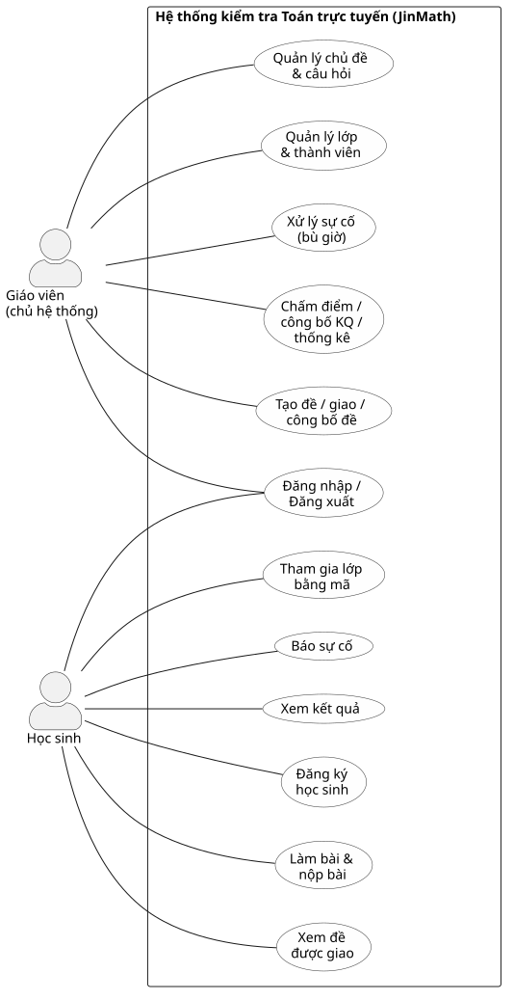
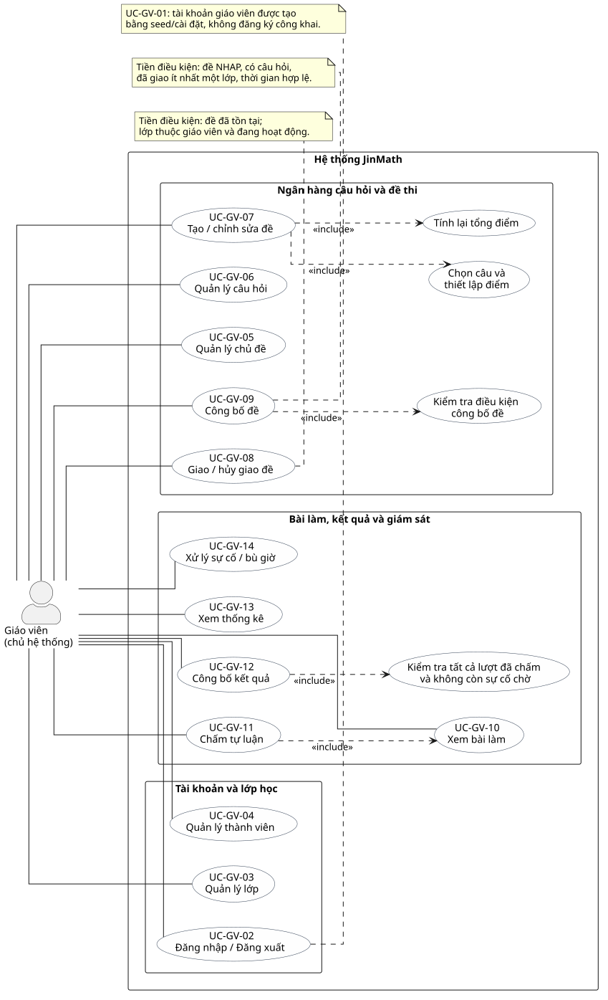
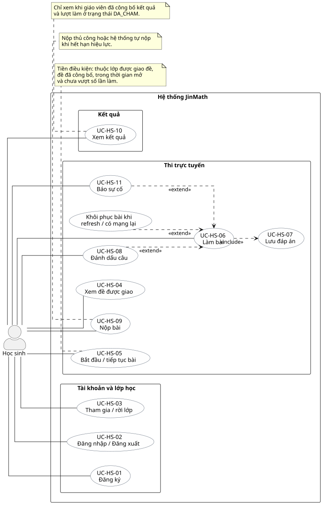
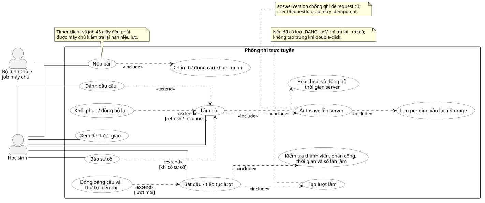

# Sơ đồ Use Case (UML) — JinMath

> Đây là **sơ đồ use case UML**, không phải sơ đồ tuần tự.  
> Ký hiệu: actor (người) · use case (hình ellipse) · khung hệ thống · nét liền = association · nét đứt `<<include>>` / `<<extend>>`.

**Xem trước:** mở `docs/use-case-diagrams-preview.html`  
**Ảnh chèn Word:** thư mục `docs/diagrams/*.png`  
**Mã nguồn UML:** `docs/diagrams/*.puml` (PlantUML)

| Mã | File ảnh | Nội dung |
|----|----------|----------|
| UCD-01 | `ucd-01-overview.png` | Tổng quan 2 actor |
| UCD-02 | `ucd-02-teacher.png` | Góc nhìn Giáo viên |
| UCD-03 | `ucd-03-student.png` | Góc nhìn Học sinh |
| UCD-04 | `ucd-04-exam-taking.png` | Luồng làm bài (include/extend) |

---

## UCD-01 — Tổng quan hệ thống

---

## UCD-02 — Góc nhìn Giáo viên

| Quan hệ | Ý nghĩa |
|---------|---------|
| UC-GV-07 `<<include>>` Chọn câu và thiết lập điểm | Đây là bước bắt buộc khi cấu hình nội dung đề |
| UC-GV-07 `<<include>>` Tính lại tổng điểm | Tổng điểm được đồng bộ theo điểm từng câu |
| UC-GV-09 `<<include>>` Kiểm tra điều kiện công bố | Kiểm tra trạng thái NHAP, câu hỏi, lớp được giao, tổng điểm và thời gian |
| UC-GV-11 `<<include>>` UC-GV-10 | Chấm trên bài đã nộp |
| UC-GV-12 `<<include>>` Kiểm tra điều kiện kết quả | Mọi lượt phải đủ điều kiện và không còn sự cố chờ |
| UC-GV-01 | Ngoài biên runtime: seed/cài đặt, không association từ actor |

Việc “đề đã tồn tại”, “đã giao lớp” hoặc “đã chấm đủ” là **tiền điều kiện**, không
biểu diễn sai thành quan hệ `include` giữa các mục tiêu độc lập.

---

## UCD-03 — Góc nhìn Học sinh

| Quan hệ | Ý nghĩa |
|---------|---------|
| UC-HS-06 `<<include>>` UC-HS-07 | Khi làm bài, đáp án được lưu tự động |
| UC-HS-08 `<<extend>>` UC-HS-06 | Đánh dấu câu — tùy chọn |
| UC-HS-11 `<<extend>>` UC-HS-06 | Báo sự cố — khi gặp sự cố |
| Khôi phục phiên `<<extend>>` UC-HS-06 | Chỉ phát sinh khi refresh hoặc kết nối lại |

“Thuộc lớp được giao đề”, “đề đang mở” và “chưa vượt số lần làm” là tiền điều kiện
của UC-HS-05. UC-HS-09 có thể do học sinh nộp hoặc hệ thống tự nộp khi hết hạn.

---

## UCD-04 — Phòng thi (cốt lõi đề tài)

Actor phụ **Bộ định thời / job máy chủ** kích hoạt Nộp bài khi hết hạn. Bắt đầu lượt
`include` kiểm tra điều kiện và tạo/tiếp tục lượt; đóng băng câu `extend` trường hợp
lượt mới. Làm bài `include` autosave, localStorage và heartbeat; khôi phục phiên,
đánh dấu câu và báo sự cố là các hành vi mở rộng. Nộp bài `include` chấm tự động
các câu khách quan.

---

## Nguồn PlantUML

Các file `.puml` nằm tại `docs/diagrams/`. Chỉnh sửa rồi render lại bằng [Kroki](https://kroki.io) hoặc [PlantUML Online](https://www.plantuml.com/plantuml).
